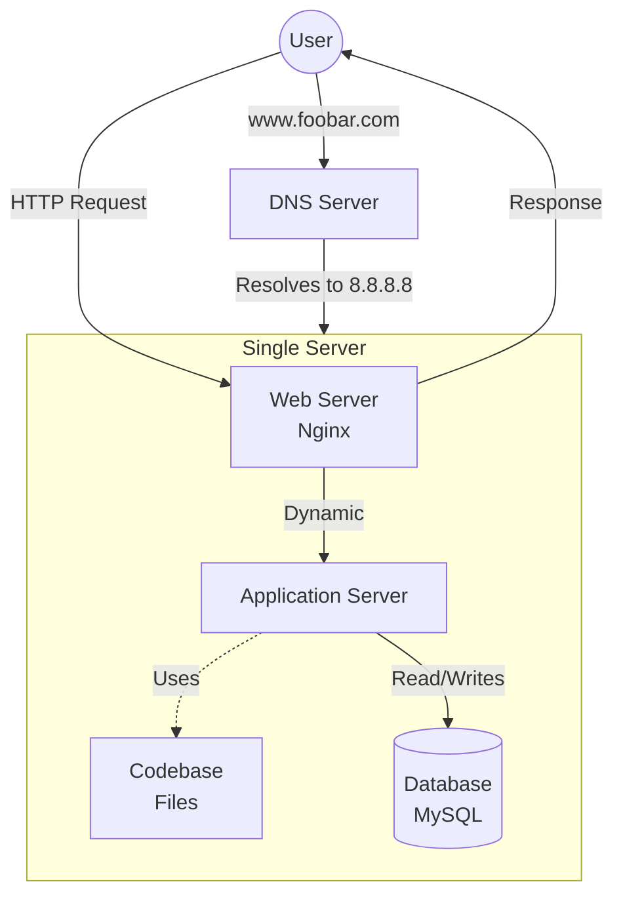

# Web Infrastructure Design

## Diagram

## Questions and Answers

| Question | Answer |
|-----------|----------|
| What is a server? | A physical or virtual machine (or software) that provides services to clients over a network. |
| Role of the domain name? | Human-readable alias for the IP address. Users type `foobar.com` instead of `8.8.8.8`. |
| DNS record type for www? | A Record – maps the subdomain directly to the IPv4 address. |
| Role of the web server (Nginx)? | Receives HTTP requests, serves static files, and forwards dynamic requests to the application server. |
| Role of the application server? | Executes the codebase, processes business logic, and interacts with the database. |
| Role of the database (MySQL)? | Stores and retrieves structured data (users, content, etc.). |
| Communication protocol? | TCP/IP – the foundation of internet communication. |
| Issues? | 1. SPOF – one server fails → entire site down. 2. Downtime during maintenance. 3. Cannot scale – single server can't handle high traffic. |
