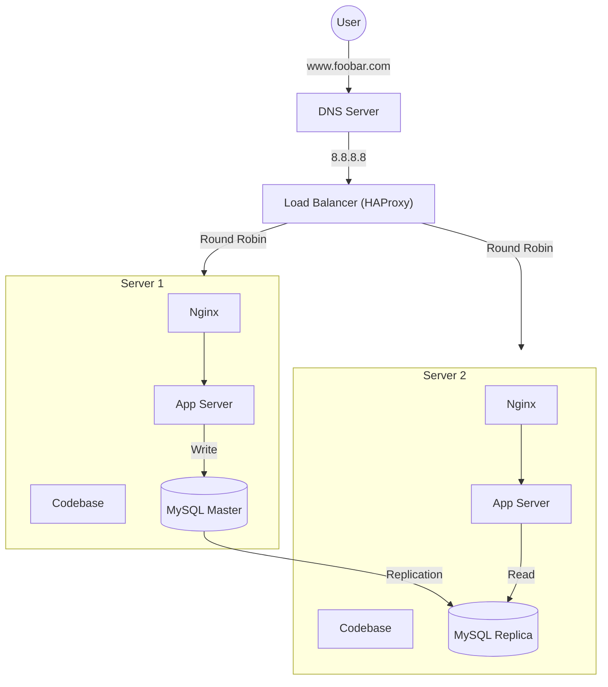

# Web Infrastructure Design

## Diagram

## Questions & Answers

### Why add a load balancer?
To distribute incoming traffic across multiple servers, reducing load on any single server and improving reliability.

### Why add a second server?
For redundancy – if one server fails, the other continues serving traffic.

### Why add a database replica?
To separate reads from writes, improve performance, and provide a backup.

### Load balancer algorithm?
Round Robin – requests are cycled sequentially (1st → Server1, 2nd → Server2, etc.).

### Active-Active or Active-Passive?
Active-Active – both servers handle live traffic simultaneously.

### How does Master-Replica work?
Master handles all writes (INSERT/UPDATE/DELETE) and replicates data to the Replica, which serves reads (SELECT).

### Difference for the application?
Application writes to Master and reads from Replica.

### Remaining issues?
- SPOF still exists (load balancer or Master DB).
- No firewall – insecure.
- No HTTPS – unencrypted traffic.
- No monitoring – can't detect failures early.
