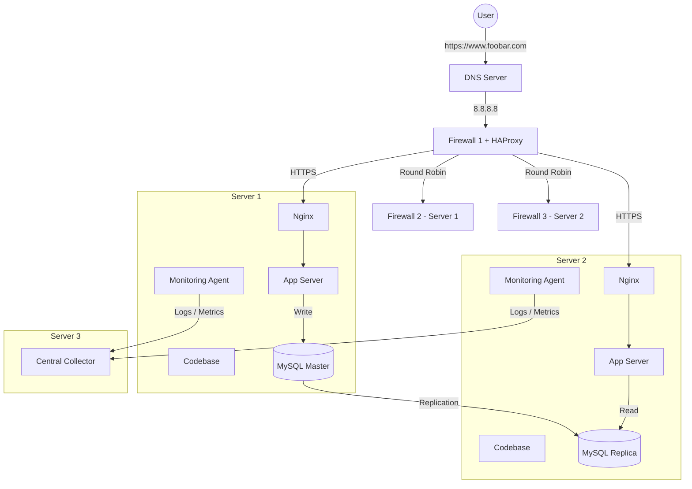

# Secured and Monitored Web Infrastructure

## Diagram

## Questions & Answers

| Question | Answer |
|-----------|-----------|
| Why add 3 firewalls? | To protect the network at multiple layers. One firewall is placed in front of the load balancer, and the others protect the servers from unauthorized access. |
| Why HTTPS? | To encrypt traffic between users and servers, protecting sensitive data from eavesdropping and tampering. |
| Why 3 monitoring clients? | To collect performance metrics and logs from each server and send them to a centralized monitoring service. |
| How does monitoring collect data? | Monitoring agents run on each server, gather logs and system metrics, then forward them to a central collector. |
| How to monitor QPS? | By analyzing Nginx access logs and counting the number of requests received per second. |
| Issue: SSL termination at LB? | If HTTPS is terminated at the load balancer and traffic is forwarded internally using HTTP, internal communications are not encrypted. |
| Issue: Single Master for writes? | If the Master database fails, write operations cannot be performed until failover occurs. |
| Issue: All components on same servers? | Sharing CPU, memory, and disk resources can create performance bottlenecks. Separating services improves scalability and reliability. |
