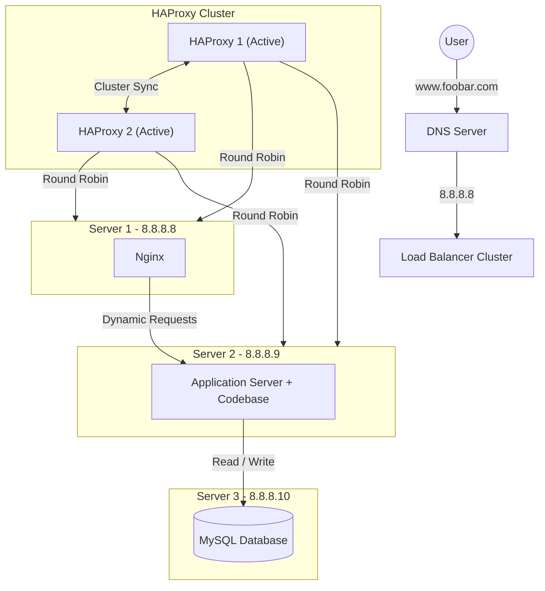

# Web Infrastructure Design

## Diagram

## Questions & Answers

### Why add a 3rd server?
To dedicate a server solely to the database. This isolates I/O-intensive database operations from the web and application layers, reducing resource contention and improving performance.

### Why add a 2nd load balancer?
To create a High Availability (HA) cluster with the first load balancer. This removes the load balancer as a Single Point of Failure (SPOF). If one load balancer fails, the other continues serving traffic.

### Why split components (Web, App, DB) onto separate servers?

1. **Resource Optimization**  
   Each component has different resource requirements:
   - Web Server → Network I/O
   - Application Server → CPU and Memory
   - Database Server → Disk I/O

2. **Security Isolation**  
   Compromising one layer does not automatically expose the others, especially the database layer.

3. **Easier Maintenance**  
   Each tier can be upgraded, restarted, or maintained independently.

4. **Better Scalability**  
   Additional web or application servers can be added without modifying the database layer.
